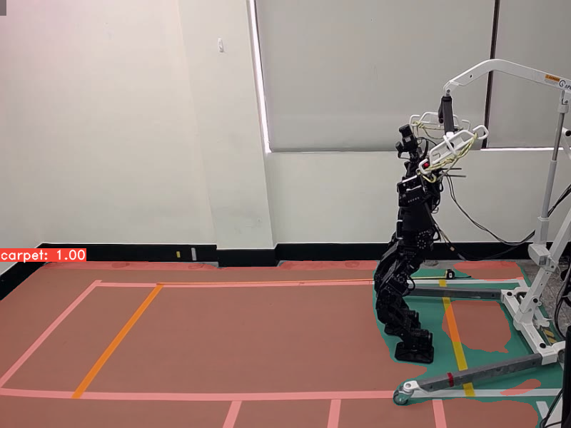
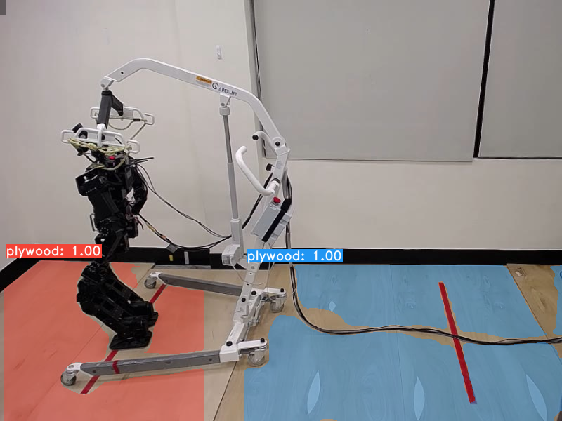
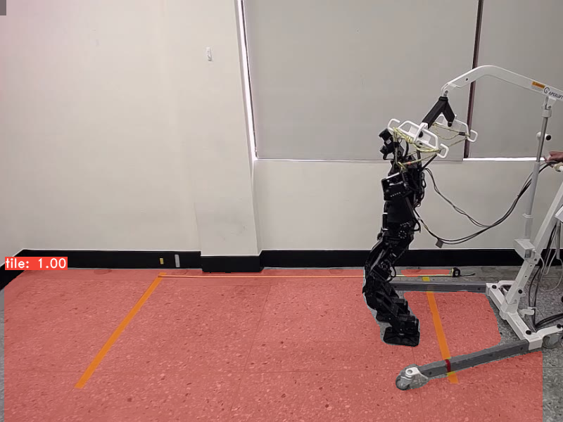

# **Y**ou **O**nly **L**ook **A**t **C**oefficien**T**s
```
    ██╗   ██╗ ██████╗ ██╗      █████╗  ██████╗████████╗
    ╚██╗ ██╔╝██╔═══██╗██║     ██╔══██╗██╔════╝╚══██╔══╝
     ╚████╔╝ ██║   ██║██║     ███████║██║        ██║   
      ╚██╔╝  ██║   ██║██║     ██╔══██║██║        ██║   
       ██║   ╚██████╔╝███████╗██║  ██║╚██████╗   ██║   
       ╚═╝    ╚═════╝ ╚══════╝╚═╝  ╚═╝ ╚═════╝   ╚═╝ 
```

This repository based on the original [YOLACT](https://github.com/dbolya/yolact). A simple fully convolutional model for real-time instance segmentation.

## What's new?
I've added a new backbone of ResNet18 & ResNet34 (the goal to aim faster FPS on moderate GPU)

## Getting Started
These instructions will show you how to train YOLACT on custom dataset. The details of labeling data, converting to COCO format, and download the pretrained weight. Therefore, in this repository, we will trained YOLACT for 3 different floors detection.








---
## Prerequisites
Tested on MSI-GP63 (Leopard 8RE):
1. 8th Gen. Intel® Core™ i7 processor
2. GTX 1060 6GB GDDR5 with desktop level performance
3. Memory 16GB DDR4 2666MHz
4. SSD 256 GB
5. Ubuntu 16.04.06 LTS (with ROS Kinetic)


---
## Table of Contents

[TOC]


---
## Installation
 - Clone this repository and enter it:
   ```Shell
   git clone https://github.com/ahanjaya/YOLACT-Floor.git yolact-floor/
   cd yolact-floor/
   ```
 - Set up the environment using one of the following methods:
   - Using [Anaconda](https://www.anaconda.com/distribution/)
     - Run `conda env create -f environment.yml`


---
## Labeling Images

This part used [labelme](https://github.com/wkentaro/labelme) for labeling images.

- Install **labelme** software:

    ```
    sudo apt-get install python3-pyqt5
    pip install labelme
    ```

- Download floor images (custom dataset):
    ```
    mkdir datasets/
    cd datasets/
    wgets https://drive.google.com/open?id=1uqjC78Ix7Bshk9lrXHc1uXTK4l5Iqxgz
    ```

- Start labeling (the provided custom dataset is already partial labeled):
    ```
    labelme
    # then open directory pointing to custom dataset
    ```
    <center>
       
    </center>


---
## Converting to COCO format

After finished labeling the custom dataset, the next step is converting all labels to COCO format. In this part, I'm using [labelm2coco](https://github.com/Tony607/labelme2coco) repository for converting to COCO format.

- Converting:
    ```
    cd yolact-floor/dataset
    git clone https://github.com/Tony607/labelme2coco.git
    cp labelme2coco/labelme2coco.py .
    python labelme2coco.py robot_images/  --output "captions_train_wolf.json"
    python labelme2coco.py tripod_images/ --output "captions_val_wolf.json"
    ```

 - A couple things to note:
   - Class IDs in the annotation file should start at 1 and increase sequentially on the order of `class_names`.
   - Open `captions_train_wolf.json` and `captions_val_wolf.json` using any source-code editor (e.g [Visual Studio Code](https://code.visualstudio.com/))
   - Use find and replace function and replace all `"category_id"` as shown below:
       ```
       find "category_id": 2, replace with "category_id": 3,
       find "category_id": 1, replace with "category_id": 2,
       find "category_id": 0, replace with "category_id": 1,
       ```
   - Replace `"id"` in `"categories"` sub-section, since the id should start from 1 (**don't use find and replace function**, just copy below example or manually replace the id number)
       ```
       "categories": [
            {
                "supercategory": "carpet",
                "id": 1,
                "name": "carpet"
            },
            {
                "supercategory": "plywood",
                "id": 2,
                "name": "plywood"
            },
            {
                "supercategory": "tile",
                "id": 3,
                "name": "tile"
            }
        ],
       ```


---
## Training

 - To train, grab an imagenet-pretrained model and put it in `./weights`.
```
mkdir weights
cd weights

# resnet18
wget https://download.pytorch.org/models/resnet18-5c106cde.pth
# resnet34
wget https://download.pytorch.org/models/resnet34-333f7ec4.pth
# resnet50
wget https://download.pytorch.org/models/resnet50-19c8e357.pth
# resnet101
wget https://download.pytorch.org/models/resnet101-5d3b4d8f.pth resnet101_reducedfc.pth
resnet152
wget https://download.pytorch.org/models/resnet152-b121ed2d.pth
```

 - Run one of the training commands below.
   - Note that you can press ctrl+c while training and it will save an `*_interrupt.pth` file at the current iteration.
   - All weights are saved in the `./weights` directory by default with the file name `<config>_<epoch>_<iter>.pth`.

```Shell
# Trains using the wolf config with a batch size of 8 (the default).
# in order to change resnet backbone just simply change the ResNet with desired ResNet
python train.py --config=wolf_resnet50_config

# Trains wolf_resnet50_config with a batch_size of 16. if you have larger GPU vram
python train.py --config=yolact_base_config --batch_size=16

# Resume training yolact_base with a specific weight file and start from the iteration specified in the weight file's name.
python train.py --config=yolact_base_config --resume=weights/wolf_resnet50_10_32100.pth --start_iter=-1
```


---
## Logging & Plotting
* YOLACT now logs training and validation information by default. You can disable this with `--no_log`. A guide on how to visualize these logs is coming soon, but now you can look at `LogVizualizer` in `utils/logger.py` for help.
* Plotting the validation mAP and loss value from the log files.
    ```
    python utils/elogger.py logs/wolf_resnet50.log
    ```


---
## Qualitative Results on COCO
```Shell
# Display qualitative results on COCO. From here on I'll use a confidence threshold of 0.15.
python eval.py --trained_model=weights/yolact_base_54_800000.pth --score_threshold=0.15 --top_k=15 --display
```


---
## Benchmarking on COCO
```Shell
# Run just the raw model on the first 1k images of the validation set
python eval.py --trained_model=weights/yolact_base_54_800000.pth --benchmark --max_images=1000
```


---
## Images
```Shell
# Display qualitative results on the specified image.
python eval.py --trained_model=weights/yolact_base_54_800000.pth --score_threshold=0.15 --top_k=15 --image=my_image.png

# Process an image and save it to another file.
python eval.py --trained_model=weights/yolact_base_54_800000.pth --score_threshold=0.15 --top_k=15 --image=input_image.png:output_image.png

# Process a whole folder of images.
python eval.py --trained_model=weights/yolact_base_54_800000.pth --score_threshold=0.15 --top_k=15 --images=path/to/input/folder:path/to/output/folder
```


---
## Video
```Shell
# Display a video in real-time. "--video_multiframe" will process that many frames at once for improved performance.
# If you want, use "--display_fps" to draw the FPS directly on the frame.
python eval.py --trained_model=weights/yolact_base_54_800000.pth --score_threshold=0.15 --top_k=15 --video_multiframe=4 --video=my_video.mp4

# Display a webcam feed in real-time. If you have multiple webcams pass the index of the webcam you want instead of 0.
python eval.py --trained_model=weights/yolact_base_54_800000.pth --score_threshold=0.15 --top_k=15 --video_multiframe=4 --video=0

# Process a video and save it to another file. This uses the same pipeline as the ones above now, so it's fast!
python eval.py --trained_model=weights/yolact_base_54_800000.pth --score_threshold=0.15 --top_k=15 --video_multiframe=4 --video=input_video.mp4:output_video.mp4
```


---
## Multi-GPU Support
YOLACT now supports multiple GPUs seamlessly during training:

 - Before running any of the scripts, run: `export CUDA_VISIBLE_DEVICES=[gpus]`
   - Where you should replace [gpus] with a comma separated list of the index of each GPU you want to use (e.g., 0,1,2,3).
   - You should still do this if only using 1 GPU.
   - You can check the indices of your GPUs with `nvidia-smi`.
 - Then, simply set the batch size to `8*num_gpus` with the training commands above. The training script will automatically scale the hyperparameters to the right values.
   - If you have memory to spare you can increase the batch size further, but keep it a multiple of the number of GPUs you're using.
   - If you want to allocate the images per GPU specific for different GPUs, you can use `--batch_alloc=[alloc]` where [alloc] is a comma seprated list containing the number of images on each GPU. This must sum to `batch_size`.


---
## Citation
If you use YOLACT or this code base in your work, please cite the original Authors
```
@inproceedings{yolact-iccv2019,
  author    = {Daniel Bolya and Chong Zhou and Fanyi Xiao and Yong Jae Lee},
  title     = {YOLACT: {Real-time} Instance Segmentation},
  booktitle = {ICCV},
  year      = {2019},
}
```